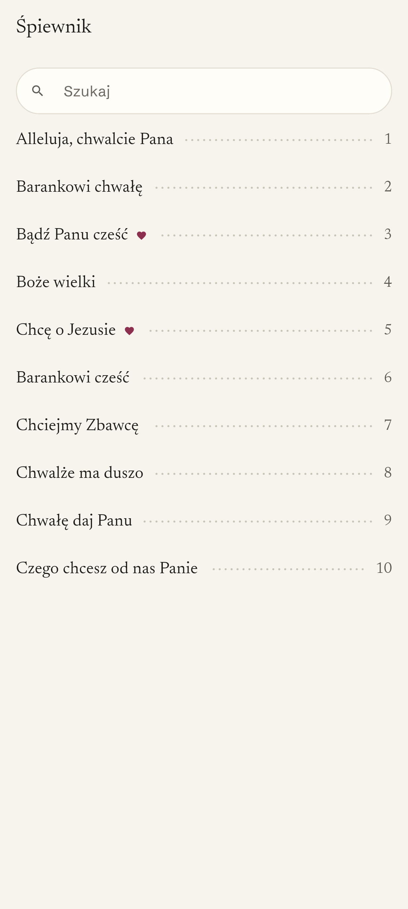
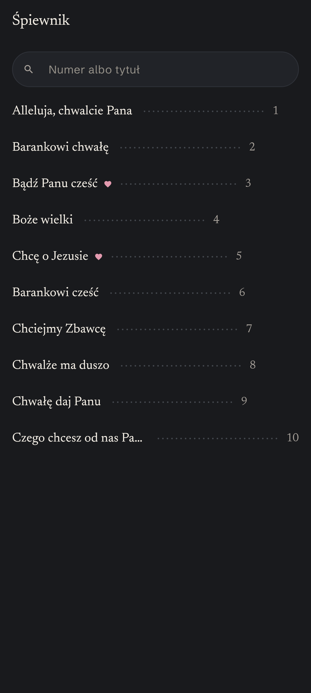
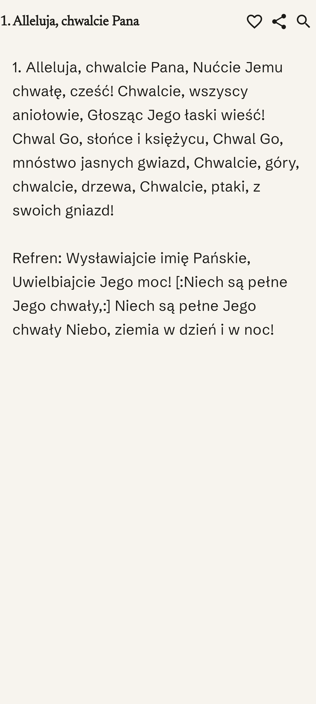
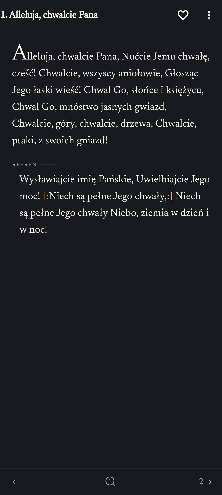

# Śpiewnik

Śpiewnik ("songbook") is a Polish hymnal app for iOS and Android. It holds about 2000 church songs,
works fully offline and has no accounts or backend. You can search by title, lyrics or number,
mark favorites, add your own songs and adjust the text size. The interface and the song texts
are in Polish.

| Song list | | Song text | |
|---|---|---|---|
|  |  |  |  |

The screenshots are the golden test images, so they always show the current UI.

## Download

- [App Store](https://apps.apple.com/pl/app/%C5%9Bpiewnik/id1585415639)
- [Google Play](https://play.google.com/store/apps/details?id=com.nm.spiewnik)

## Stack

- Flutter 3.47.4, one codebase for iOS and Android.
- [ObjectBox](https://objectbox.io/) for songs, favorites and user songs; SharedPreferences for settings.
- No backend. The songs ship as an asset (`assets/songs_data.json`) and are loaded into the database on first run.

## Running locally

Requirements: Flutter 3.47.4, Xcode with CocoaPods for iOS (ObjectBox is the only pod), Android Studio or
the Android SDK for Android.

```sh
flutter pub get
flutter run
```

## Running tests

Tests that use the database need the native ObjectBox library in `lib/` (`libobjectbox.dylib` on macOS,
`libobjectbox.so` on Linux). It is not committed; download it once after cloning:

```sh
tools/fetch_objectbox_lib.sh
flutter test
flutter analyze
```

The first `flutter test` also downloads a prebuilt SQLite library, so it needs network access.

Golden tests (screenshots of every screen in both themes) run only on Linux, because font rendering
differs between systems. Locally they run in a Docker container with the same Flutter version as CI:

```sh
tools/golden.sh            # compare the UI with the committed images
tools/golden.sh --update   # regenerate the images after an intended UI change
```

On macOS, plain `flutter test` skips them; CI runs them on every pull request.

## Project structure

```
lib/
  data/        repositories, the only UI-facing access to the database
  migration/   one-time migration from the old iOS app (Core Data) and its settings
  model/       ObjectBox entities, settings models, Polish collation
  theme/       colors, typography, text scale
  view/        screens and widgets
  viewmodel/   view models (plain classes with ValueNotifier)
test/          unit, widget and golden tests; fakes and fixtures in support/ and fixtures/
tools/         ObjectBox library download, golden test container, font and song data scripts
assets/        song data and fonts
docs/          design and development notes
ios/, android/ native projects
```

## Documentation

- [docs/DEVELOPMENT.md](docs/DEVELOPMENT.md): test details, CI, the end-to-end migration test and known pitfalls.
- [docs/RELEASING.md](docs/RELEASING.md): how a new version is released on Google Play and the App Store.
- [docs/DESIGN-SYSTEM.md](docs/DESIGN-SYSTEM.md): the visual design system the UI is built from (in Polish).
- [docs/PARITY.md](docs/PARITY.md): differences between this app and the old native iOS app (in Polish).
- [docs/SCHEMA-ZMYSONG.md](docs/SCHEMA-ZMYSONG.md): the database schema of the old iOS app, used by the migration.
- [docs/AUDIT.md](docs/AUDIT.md), [docs/ARCHITECTURE-PROPOSAL.md](docs/ARCHITECTURE-PROPOSAL.md): historical notes
  from before the migration and redesign (in Polish).

## License

The code is released under the [MIT License](LICENSE). The fonts in `assets/fonts/` are under the SIL Open Font
License (see the `*-OFL.txt` files next to them).
